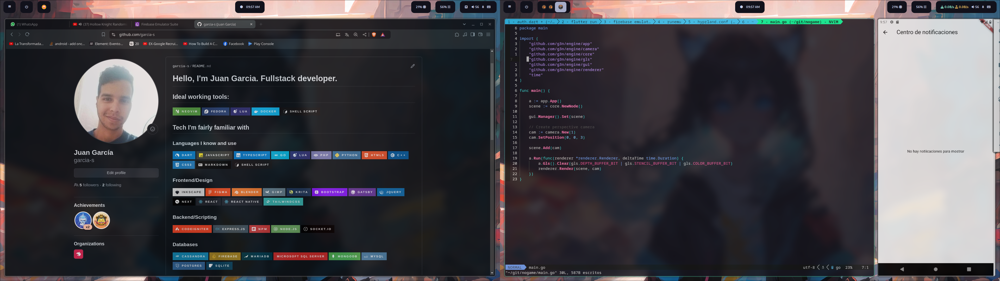
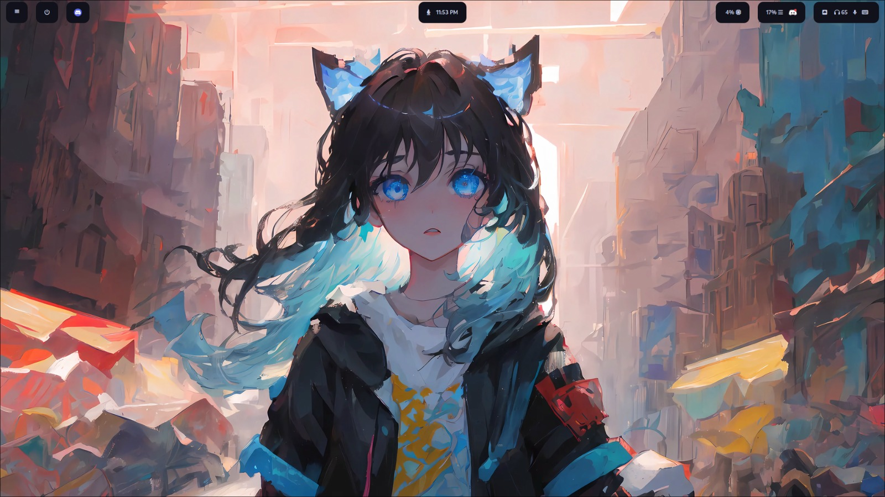
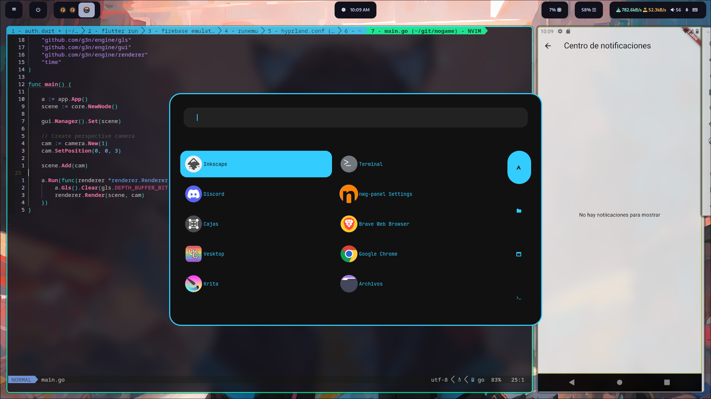

# My hyprland Fedora config

No build or install script yet, just the raw config files and some images

If you want to see what it looks like, here you go:

# Full desktop 2 Screens

# No apps open

# App menu with rofi (Modified from hyprdots)

# Steam/Lutris Game manu (literally stolen from hyprdots HyDE)

# Simple kitty config

# Shutdown menu (also modified from HyDE's design)

